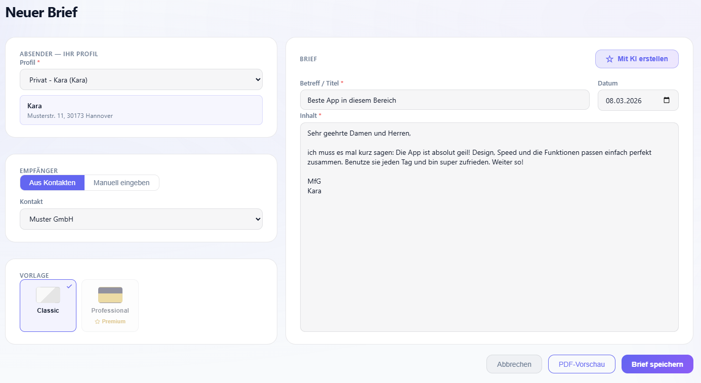
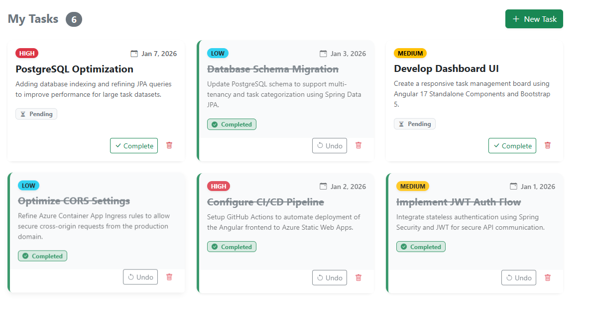

# Kaan Kara

**Full-Stack Developer** — Java & Angular

I build scalable, production-grade applications with a strong focus on clean architecture, cloud infrastructure, and security. My core stack is **Spring Boot** on the backend and **Angular** on the frontend.

---

### Tech Stack

| Category | Technologies |
| :--- | :--- |
| **Backend** |    |
| **Frontend** |     |
| **Database & Cache** |    |
| **Cloud & DevOps** |    |
| **Testing** |   |
| **AI Tools** |   |

---

### On Using AI Tools

I use **Claude Code** and **Gemini** as part of my daily workflow — not as autopilots, but as tools I direct with intent.

- I own the architecture. Every structural and design decision is mine.
- I review all AI-generated code before it goes anywhere near a codebase.
- No vibe coding. I understand what I ship.

AI accelerates the work. It doesn't replace the thinking.

---

### Featured Project: Brief-Fix — AI-Powered German Letter Generator

A production-grade web app that generates DIN 5008-compliant German letters as PDFs, with AI-assisted composition and multi-template support.

* **Backend**: Java 21 + Spring Boot 3.4, JWT auth with token rotation, Google OAuth integration
* **Security**: Redis-backed token blacklisting & rate limiting, email verification flow
* **AI**: Google Gemini API (`gemini-2.5-flash`) for AI-assisted letter body generation
* **PDF**: Thymeleaf + OpenHTMLtoPDF rendering — DIN 5008 compliant, window-envelope ready
* **Frontend**: Angular 17+ Standalone Components, SCSS, Web Speech API (voice input), live PDF preview
* **Infrastructure**: Dockerized, deployed on Google Cloud Run

**[Live Demo](https://www.brief-fix.de/)** | **[Frontend](https://github.com/Kaandroids/Brieffix-Frontend)** | **[Backend](https://github.com/Kaandroids/Brieffix-Backend)**

---

  

---

### Featured Project: 2Do — Enterprise Task Management

A production-grade task management system built with cloud-native architecture in mind.

* **Backend**: Java 21 + Spring Boot 3.4, stateless REST API with JWT auth
* **Security**: Redis-backed JWT blacklisting for secure logout, Redis rate limiting for API abuse prevention
* **Performance**: Azure Cache for Redis — sub-millisecond data retrieval, reduced DB load
* **Frontend**: Angular 17 Standalone Components with reactive state via RxJS
* **Infrastructure**: Dockerized, deployed on Azure Container Apps & Static Web Apps, CI/CD via GitHub Actions

**[Live Demo](https://gentle-cliff-06c31ee03.6.azurestaticapps.net/)** | **[Frontend](https://github.com/kaandroids/2Do-frontend)** | **[Backend](https://github.com/kaandroids/2Do-backend)**

---

  

---

### 📬 Connect

